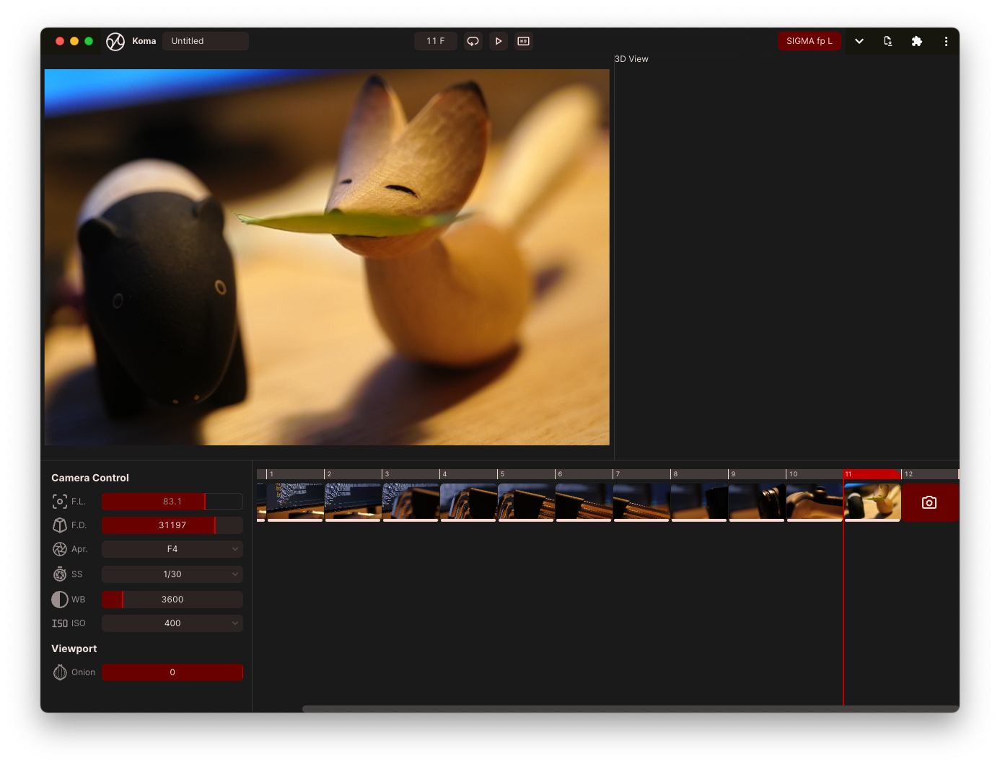

<div align="center">
  
  <h1>Koma</h1>
  
</div>

A open-source stop-motion tool that runs on browsers. It allows you to shoot while tethring usb-connected cameras such as DSLMs, DSLRs, and webcams. Technically, it's bulit upon [Picture Transfer Protocol](https://en.wikipedia.org/wiki/Picture_Transfer_Protocol), [WebUSB API](https://developer.mozilla.org/en-US/docs/Web/API/USB) and its wrapper library [Tethr](https://github.com/baku89/tethr). Note that this project has been developed for my own animation project and is still in early stage of working-in-progress. So it might not work in your environment yet.

FYI, Koma (コマ) means “frames” in Japanese, but I'm wondering if there's nicer name for the app.

## Development

```bash
git clone --recursive https://github.com/baku89/koma
yarn install
yarn dev
```

## Credits

- Sound Effects by [OtoLogic](https://otologic.jp/free/license.html) ([CC-BY 4.0](https://creativecommons.org/licenses/by/4.0/))

```

```
